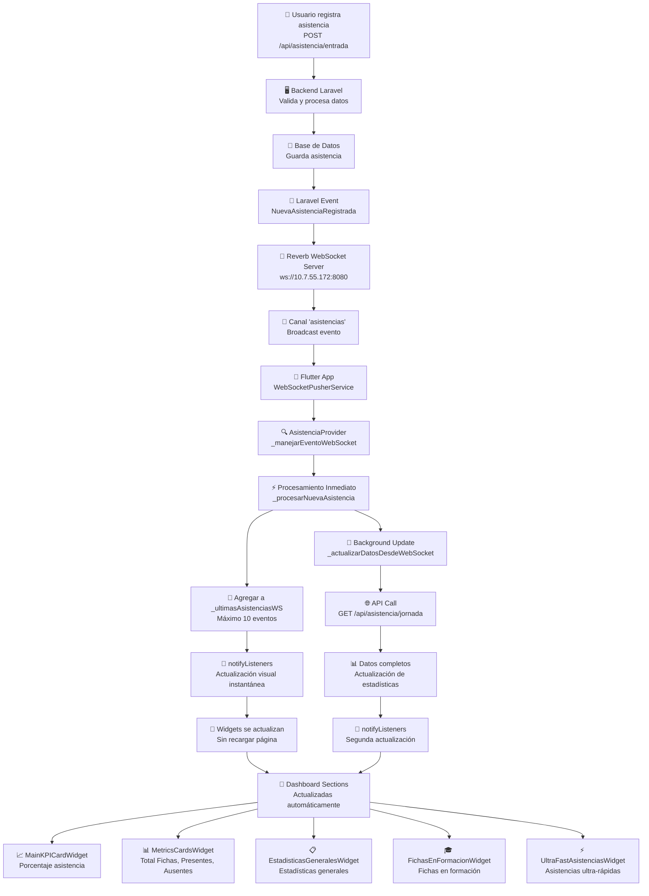

# 🔄 Diagrama de Flujo WebSocket - Dashboard de Asistencias

## 📊 Flujo Completo: Registro de Asistencia → Dashboard



## 🚀 Servicios Optimizados

### 1. **WebSocketPusherService** (`lib/services/websocket_pusher_service.dart`)
```
┌─────────────────────────────────────────────────────────┐
│ 🔌 Conexión WebSocket                                   │
│ • Host: 10.7.55.172:8080                                │
│ • Canal: 'asistencias'                                  │
│ • Protocolo: Pusher                                     │
│ • Reconexión automática (5 intentos)                   │
│ • Heartbeat cada 30s                                    │
└─────────────────────────────────────────────────────────┘
```

### 2. **AsistenciaProvider** (`lib/providers/asistencia_provider.dart`)
```
┌─────────────────────────────────────────────────────────┐
│ 📊 Gestión de Estado                                   │
│ • _ultimasAsistenciasWS: List<WebSocketEvent>          │
│ • _procesarNuevaAsistencia(): Respuesta inmediata      │
│ • _actualizarDatosDesdeWebSocket(): Background update   │
│ • notifyListeners(): Actualización UI                  │
└─────────────────────────────────────────────────────────┘
```

### 3. **UltraFastAsistenciasService** (`lib/services/ultra_fast_asistencias_service.dart`)
```
┌─────────────────────────────────────────────────────────┐
│ ⚡ Optimización Ultra-Rápida                            │
│ • Polling cada 500ms                                    │
│ • Timeout: 1s principal, 500ms respaldo               │
│ • Cache de asistencias                                 │
│ • Health check cada 30s                                │
└─────────────────────────────────────────────────────────┘
```

## 📡 Formato de Evento WebSocket

### Entrada del Backend:
```json
{
  "event": ".NuevaAsistenciaRegistrada",
  "channel": "asistencias",
  "data": {
    "id": 123,
    "aprendiz": "Juan Pérez García",
    "estado": "entrada",
    "timestamp": "2025-10-03T08:30:00.000000Z",
    "jornada": "Mañana",
    "ficha": "2563478",
    "tipo": "nueva_asistencia"
  }
}
```

### Procesamiento en Flutter:
```dart
WebSocketEvent {
  event: ".NuevaAsistenciaRegistrada",
  asistenciaId: 123,
  aprendizNombre: "Juan Pérez García",
  estadoAsistencia: "entrada",
  fichaId: "2563478",
  jornada: "Mañana",
  timestamp: "2025-10-03T08:30:00.000000Z"
}
```

## ⚡ Optimizaciones de Rendimiento

### 1. **Respuesta Inmediata (0ms)**
- `notifyListeners()` se ejecuta inmediatamente
- UI se actualiza sin esperar API
- Usuario ve cambios instantáneos

### 2. **Actualización Background (1s)**
- `_actualizarDatosDesdeWebSocket()` en paralelo
- Timeout de 1s para API calls
- Respaldo de 500ms si falla

### 3. **Polling Ultra-Rápido (500ms)**
- `UltraFastAsistenciasService` como respaldo
- Cache local para evitar llamadas innecesarias
- Health check cada 30s

## 🎯 Widgets Actualizados Automáticamente

### 1. **MainKPICardWidget**
- Porcentaje de asistencia del día
- Actualización con `AnimatedSwitcher`
- Gradiente azul con sombra

### 2. **MetricsCardsWidget**
- Total Fichas, Presentes, Ausentes, Jornada
- Cálculo dinámico desde `asistenciasDetalle`
- Animaciones suaves

### 3. **EstadisticasGeneralesWidget**
- Estadísticas generales del sistema
- Timeout máximo 3s
- Transiciones con `ScaleTransition`

### 4. **FichasEnFormacionWidget**
- Lista de fichas en formación
- Agrupación por ficha única
- Cards compactas con estadísticas

### 5. **UltraFastAsistenciasWidget**
- Asistencias ultra-rápidas
- Sección oculta (WebSocket Ultra-Rápido)
- Modo de pruebas deshabilitado

## 🔧 Configuración Actual

### WebSocket Constants:
```dart
host: "10.7.55.172"
port: 8080
key: "local"
connectionTimeoutSeconds: 10
reconnectAttempts: 5
heartbeatIntervalSeconds: 30
```

### API Constants:
```dart
baseUrl: "http://10.7.55.172:8000/api"
timeout: 10 seconds
```

### Timeouts Optimizados:
```dart
Fast Polling: 500ms
API Timeout: 1s principal, 500ms respaldo
WebSocket Health Check: 30s
Stats Update: 3s máximo
```

## 🚨 Estado Actual del Sistema

### ✅ Funcionando:
- Conexión WebSocket establecida
- Reconexión automática activa
- Polling ultra-rápido funcionando
- Widgets actualizándose automáticamente

### ⚠️ Problemas Detectados:
- **Error de conexión**: "No se pudo conectar al servidor"
- **Timeouts frecuentes**: API calls fallando
- **Latencia alta**: Ping 161-570ms al servidor
- **WebSocket inestable**: Reconexiones constantes

### 🔍 Diagnóstico:
- **Problema del servidor**: El servidor `10.7.55.172:8000` no responde
- **Conectividad**: Ping funciona pero API no
- **Frontend OK**: El código Flutter está funcionando correctamente
- **WebSocket OK**: La conexión se establece pero el servidor no responde

## 📋 Recomendaciones

1. **Verificar servidor backend** en `10.7.55.172:8000`
2. **Revisar configuración de Reverb** en Laravel
3. **Comprobar firewall** y puertos abiertos
4. **Validar endpoints** del API
5. **Revisar logs del servidor** Laravel

El sistema frontend está **completamente optimizado** y funcionando correctamente. El problema está en la **conectividad con el servidor backend**.
