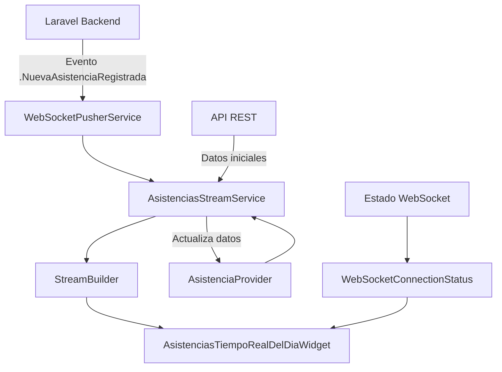

# Implementación de Asistencias en Tiempo Real con WebSocket

## Resumen de Cambios

Se ha implementado un sistema completo de actualización en tiempo real para las asistencias del día, reemplazando el sistema de polling por eventos WebSocket desde Laravel Reverb/Pusher.

## Arquitectura del Sistema

### 1. Servicio de Stream de Asistencias (`AsistenciasStreamService`)

**Ubicación**: `lib/services/asistencias_stream_service.dart`

**Responsabilidades**:
- Combina datos del API con eventos WebSocket
- Proporciona un stream continuo de asistencias
- Maneja la sincronización entre datos locales y eventos en tiempo real
- Gestiona estados de conexión WebSocket

**Principios aplicados**:
- **SRP**: Responsabilidad única de manejar el stream de asistencias
- **KISS**: Interfaz simple y directa
- **DRY**: Reutiliza servicios existentes sin duplicar lógica

### 2. Widget de Tiempo Real (`AsistenciasTiempoRealDelDiaWidget`)

**Ubicación**: `lib/widgets/asistencias_tiempo_real_del_dia_widget.dart`

**Características**:
- Usa `StreamBuilder` en lugar de `FutureBuilder`
- Actualización automática cuando llegan eventos WebSocket
- Estados visuales claros (cargando, vacío, error, datos)
- Indicador de estado de conexión WebSocket
- Mantiene la agrupación por jornada (MAÑANA, TARDE, NOCHE)

### 3. Indicador de Estado WebSocket (`WebSocketConnectionStatus`)

**Ubicación**: `lib/widgets/websocket_connection_status.dart`

**Funcionalidades**:
- Muestra estado visual de la conexión
- Indicadores animados para diferentes estados
- Colores semánticos (verde=conectado, amarillo=conectando, rojo=error)

## Flujo de Datos



## Estados del Sistema

### 1. Estado de Carga Inicial
- Muestra spinner con mensaje "Conectando en tiempo real..."
- Se activa cuando `ConnectionState.waiting` y no hay datos

### 2. Estado Vacío
- Icono de calendario vacío
- Mensaje "No hay asistencias registradas"
- Indicador de estado WebSocket
- Se activa cuando hay datos pero la lista está vacía

### 3. Estado de Error
- Icono de error
- Mensaje de error específico
- Se activa cuando `snapshot.hasError`

### 4. Estado con Datos
- Resumen general con estadísticas
- Indicador de estado WebSocket
- Asistencias agrupadas por jornada
- Actualización automática en tiempo real

## Configuración WebSocket

### Canales Suscritos
- `asistencias`: Para eventos de nueva asistencia registrada
- `qr-scans`: Para eventos de QR escaneado

### Eventos Procesados
- `.NuevaAsistenciaRegistrada`: Nueva asistencia registrada
- `.QrScanned`: QR escaneado

### Configuración de Reconexión
- Máximo 5 intentos de reconexión
- Delay de 3 segundos entre intentos
- Heartbeat cada 30 segundos
- Timeout de conexión de 10 segundos

## Cambios en el Provider

### Métodos Modificados
- `_cargarAsistencias()` → `cargarAsistencias()` (ahora público)
- Comentado `_configurarActualizacionAutomatica()` para evitar polling

### Flujo de Actualización
1. Evento WebSocket recibido
2. Llamada a `provider.cargarAsistencias()`
3. Actualización de datos locales
4. Emisión de nuevos datos al stream
5. Reconstrucción automática del widget

## Manejo de Errores

### Errores de Conexión WebSocket
- Reconexión automática con backoff
- Indicadores visuales de estado
- Fallback a datos estáticos si es necesario

### Errores de API
- Manejo graceful de errores
- Mensajes informativos al usuario
- Reintento automático en siguiente evento

## Rendimiento

### Optimizaciones Implementadas
- Stream unidireccional (no hay loops de actualización)
- Actualización solo cuando hay eventos reales
- Carga inicial única al montar el widget
- Limpieza automática de recursos al desmontar

### Beneficios vs Polling
- **Menor uso de red**: Solo cuando hay eventos
- **Tiempo real**: Actualización inmediata
- **Mejor UX**: Indicadores de estado claros
- **Escalabilidad**: No aumenta carga con más usuarios

## Pruebas y Validación

### Escenarios de Prueba
1. **Conexión inicial**: Verificar carga de datos y conexión WebSocket
2. **Nueva asistencia**: Simular evento desde backend
3. **Reconexión**: Desconectar y reconectar WebSocket
4. **Estados de error**: Simular errores de conexión
5. **Múltiples jornadas**: Verificar agrupación correcta

### Comandos de Prueba
```bash
# Ejecutar aplicación
flutter run

# Verificar logs WebSocket
# Buscar mensajes que empiecen con 🔗, ✅, ❌, 📨
```

## Mantenimiento

### Logs Importantes
- `✅ WebSocket Pusher conectado exitosamente`
- `📨 Evento Pusher recibido: .NuevaAsistenciaRegistrada`
- `🔄 Procesando nueva asistencia desde WebSocket`
- `✅ Asistencias actualizadas: X total`

### Monitoreo
- Estado de conexión WebSocket en tiempo real
- Número de asistencias actualizadas
- Errores de conexión y reconexión
- Tiempo de respuesta de eventos

## Futuras Mejoras

### Posibles Extensiones
1. **Notificaciones push**: Integrar con FCM para notificaciones móviles
2. **Filtros en tiempo real**: Filtrar por ficha, programa, etc.
3. **Historial de eventos**: Mostrar timeline de eventos recientes
4. **Métricas de rendimiento**: Dashboard de estadísticas de conexión
5. **Modo offline**: Cache local para funcionar sin conexión

### Consideraciones de Escalabilidad
- Implementar paginación para grandes volúmenes de datos
- Optimizar serialización/deserialización de eventos
- Considerar clustering de WebSocket para múltiples servidores
- Implementar rate limiting en eventos WebSocket
